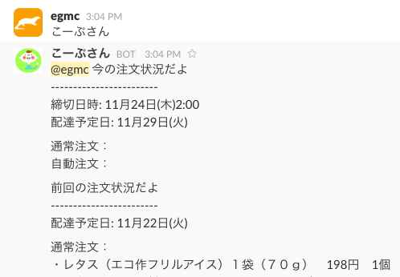
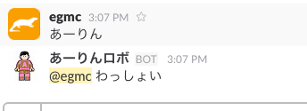
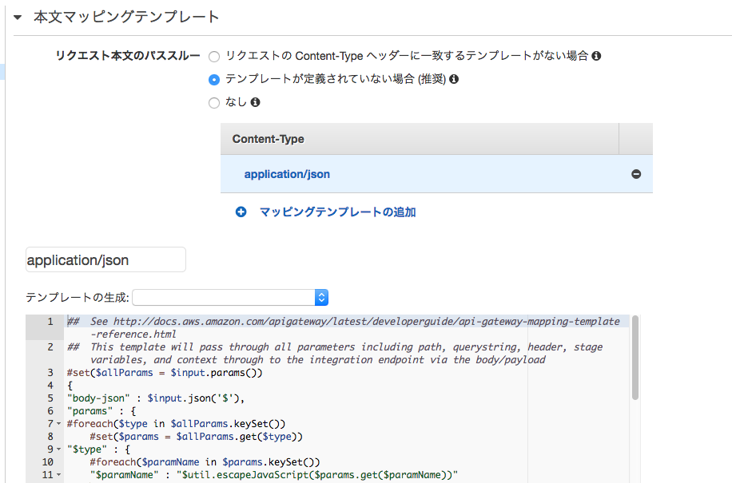

# 合宿@土善旅館

TL;DR

## API gateway割とたいへん

# やろうとしたこと

前回 https://github.com/egmc/marumo

## linebot -> slack移行

 - LINEで家庭用のbot作ってた
  - BOT API Trial終了
  - slackに移行作業をした、けどslackでの発言そのものはえらい簡単・・
  - 既存の作り（botに話しかけると特定のワードに反応して動く）はなるべく変えないでいこうということで
  - Outgoing Webhooksでbot部屋の発言を全部拾って
  - Incoming Webhookで応答（単に自由度が高くて楽そうだったので）
  
  
  - 定期的に通知を投げるものについては、Lambdaファンクションのcron実行で、slackのリクエストのフリをして反応するテキストを投げる
  - lambda->api-gateway->lambda->VPS上のbot応答サーバ->slackというちょっとめんどい経路になっている

## bot機能追加

 - チケットの締め切り通知
 - 
 - 応募締め切りの通知
 - アプリ用に用意していたAPIを拡張してlambdaで取って投げてるだけ
 - 元ネタは公式のgoogleカレンダー

## api gatewayまわりの調査

 - api gatewayを経由する理由
 - 面倒な部分（認証ロジックなど）を隠して簡単にAPIを提供したい
  - 雑にcurlでリクエストを投げるとメッセージが送れるとか
 - とはいえ全開放はしたくない
 - キーの管理もしたくない
 - 簡単にIP制限をかける程度で機能提供したい、というようなことを考えてやってみた
   - Amazon API Gateway カスタム認証
   
    - べアラートークンによる認証
    - 認証ロジックそのものはlambdaファンクションで書く
    - トークンはhttpリクエストヘッダに乗っけた任意のヘッダをMappingして取得しているので、代わりに実行コンテキストのipをMapping出来ないかと思ったが
    - 設定はmethod.request.header.hogeに限られているのでダメだった
  - ということでしょうがないので
   - とりあえず処理を実行するlambdaファンクション内で判定することにした
   - デフォルトの設定だとlambdaに渡されるパラメータ（eventオブジェクト）にはapi gatewayが受けたリクエストの内容がそのままMappingされるだけ
   - 明示的にMappingテンプレートを指定すると実行時のcontext情報をパラメータとして設定出来る->リクエスト元IPも取れる
 - 

   ```
   exports.handler = function(event, context) {

      var allowed_ips = ['153.135.218.23/32'];

      var request = require('request');
      var rangeCheck = require('range_check');

      console.log(JSON.stringify(event));
      console.log(JSON.stringify(context));

      if (rangeCheck.inRange(event['context']['source-ip'], allowed_ips)) {
        console.log(event['context']['source-ip'] + " is allowed");

      } else {
        console.log(event['context']['source-ip'] + " is not allowed");
      }
    };
    ```
    チェックロジックを分離したいけどとりあえずこんな感じで実現は出来そう。

## 鍵の隠蔽について

 - KMS使って暗号化済のキーをs3に保存、アクセス権限絞るとかでいけそう

## 色々面倒なんだけどapi gateway + lambda使うとよさそうな点

　- AWSのIAMを使った権限の制限により、安全なAPIを提供比較的簡単なインターフェースで提供出来る（使えるけど更新は権限がないと出来ない、とかそういうの）
  - 管理するサーバが必要ない
  - サーバレス、ではないが自分が管理しない、状態を（そこまで）持たないというのが楽
  - お膳立てが面倒なので、このあたりはどうにかしてほしい
